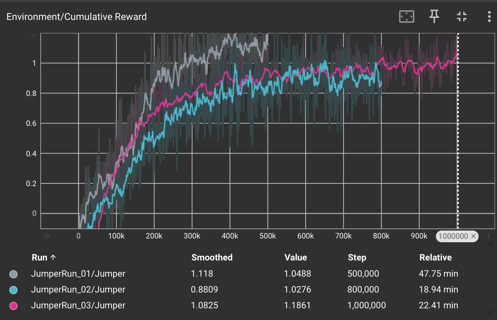

# Rapport: Optimalisatie van een Reinforcement Learning Agent voor Obstakelvermijding en Doelgerichte Navigatie

## Inleiding
Dit rapport documenteert het onderzoek naar het trainingsproces van een autonome agent binnen een gesimuleerde Unity-omgeving middels ML-Agents. Het doel is het identificeren van de meest efficiënte configuratie en beloningsstructuur om een agent gelijktijdig een bewegend obstakel te laten ontwijken en een willekeurig geplaatste bonus te laten verzamelen. Dit onderzoek is relevant voor het begrijpen van de balans tussen exploratie en exploitatie in omgevingen met conflicterende doelstellingen.

## Methoden
Voor het experiment is gebruikgemaakt van het Proximal Policy Optimization (PPO) algoritme. De omgeving bestaat uit een lineair speelveld waarin een balk met variabele snelheid (6 tot 13 units/s) beweegt. De agent beschikt over discrete acties voor springen en beweging over de Z-as.
Er zijn drie opeenvolgende experimenten uitgevoerd:

* **Baseline (Run 01):** Basisbeloningen voor overleving (+0.5) en bonuscollectie (+1.5).
* **Efficiëntie-optimalisatie (Run 02):** Introductie van een negatieve beloning (straf) van −0.01 per sprong om overbodige acties te reduceren.
* **Precisie-training (Run 03):** Aanpassing van hyperparameters (grotere batch size, lagere learning rate) en een verhoogde straf voor sprongen (−0.05) in combinatie met een straf gebaseerd op de Z-afstand tot de bonus.

## Resultaten
De verzamelde data uit TensorBoard tonen significante verschillen tussen de testruns.

* **Cumulatieve Beloning:** Run 01 vertoont een snelle initiële stijging maar stabiliseert op een niveau waarbij de bonus inconsistent wordt verzameld. Run 03 vertoont een tragere startfase, maar bereikt na circa 1.000.000 stappen een hoger gemiddeld plateau (1.18) dan de voorgaande runs.
* **Entropie:** In Run 03 is een duidelijke daling in entropie waargenomen rond 350.000 stappen, wat duidt op een toename in de zekerheid van het beleid (policy).
* **Observaties bij Inference:** Bij de uitvoering van het getrainde model uit Run 03 wordt geobserveerd dat de frequentie van het springen is afgenomen ten opzichte van Run 01. Er is echter nog sprake van een lichte instabiliteit (jitter) in de beweging over de Z-as en incidentele vroegtijdige sprongen waardoor de agent op het obstakel landt.

## Conclusie
Op basis van de resultaten lijkt de introductie van een negatieve beloning voor acties (sprongen) noodzakelijk voor het aanleren van efficiënt gedrag. De hogere cumulatieve beloning in de laatste run suggereert dat de agent de correlatie tussen de Z-positie en de bonuslocatie heeft geïdentificeerd. Het voortijdige springen duidt mogelijk op een conservatieve strategie waarbij de agent de zware straf voor een botsing tracht te vermijden ten koste van timing-precisie. Het verlagen van de Decision Period en de implementatie van Raycast-sensoren zouden in een vervolgonderzoek de jitter en timing verder kunnen optimaliseren.

## Referenties
* Unity Technologies (2024). ML-Agents Toolkit Documentation.
* Juliani, A., et al. (2018). Unity: A General Platform for Intelligent Agents. arXiv preprint arXiv:1809.02627.

## Grafieken
