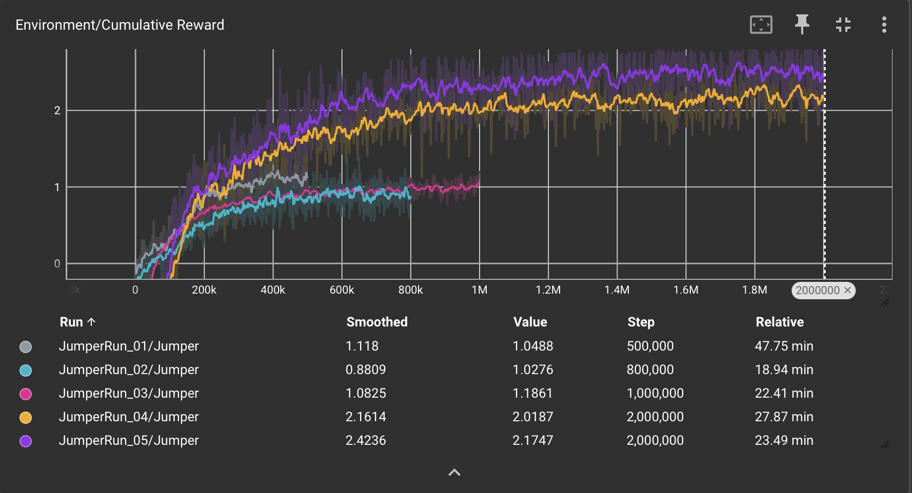
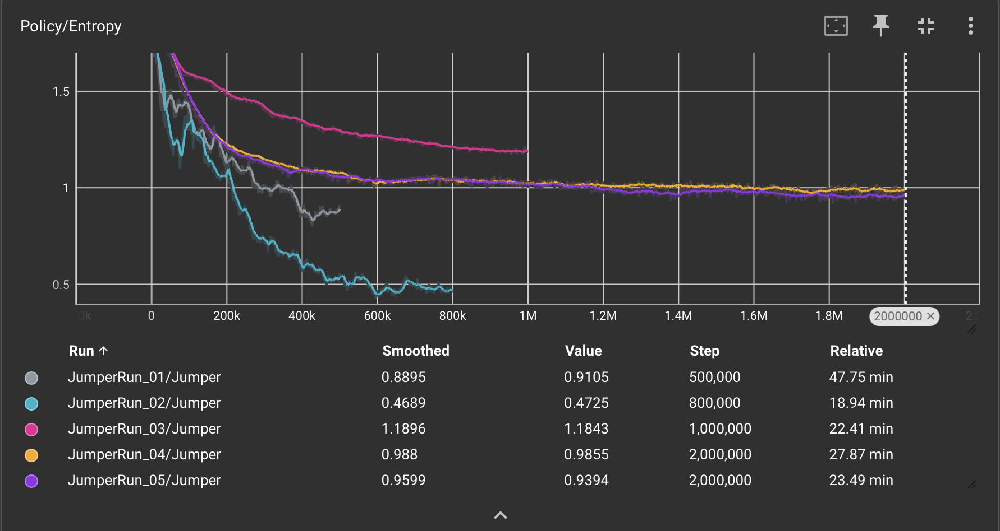

# Rapport: Optimalisatie van een Reinforcement Learning Agent voor Obstakelvermijding en Doelgerichte Navigatie

## Inleiding

Dit rapport documenteert het onderzoek naar het trainingsproces van een autonome agent binnen een gesimuleerde Unity-omgeving middels ML-Agents. Het doel is het identificeren van de meest efficiënte configuratie en beloningsstructuur om een agent gelijktijdig een bewegend obstakel te laten ontwijken en een willekeurig geplaatste bonus te laten verzamelen. Dit onderzoek is relevant voor het begrijpen van de balans tussen exploratie en exploitatie in omgevingen met conflicterende doelstellingen.

## Methoden

Voor het experiment is gebruikgemaakt van het Proximal Policy Optimization (PPO) algoritme. De omgeving bestaat uit een lineair speelveld waarin een balk met variabele snelheid (6 tot 13 units/s) beweegt. De agent beschikt over discrete acties voor springen en beweging over de Z-as.

### Scriptarchitectuur

Het gedrag van de agent is gedefinieerd in een C#-script dat overerft van de `Agent`-klasse. De volgende kernmethodes zijn geïmplementeerd voor de trainingscyclus:

* **OnEpisodeBegin():** Deze methode wordt aangeroepen bij de start van elke nieuwe trainingsessie (episode). Hierin worden de posities van de agent, het obstakel en de bonus gereset naar hun beginwaarden, vaak met een stochastisch (willekeurig) element om de robuustheid van de training te vergroten.
* **CollectObservations(VectorSensor sensor):** Hier verzamelt de agent relevante informatie uit de omgeving. In dit experiment zijn de relatieve X-afstand tot het obstakel, de relatieve Z-afstand tot de bonus, de snelheid van het obstakel en de status van de agent (geaard of in de lucht) als input meegegeven.
* **OnActionReceived(ActionBuffers actions):** Deze methode vertaalt de beslissingen van het neurale netwerk naar fysieke acties in Unity. Hier wordt de logica voor het springen en de Z-as navigatie uitgevoerd, en worden de bijbehorende beloningen of straffen (`AddReward`) toegekend op basis van de gekozen acties.
* **Heuristic(in ActionBuffers actionsOut):** Een hulpfunctie die handmatige besturing via het toetsenbord mogelijk maakt. Dit is essentieel voor het testen van de physics en het valideren van de omgeving voordat de automatische training start.
* **OnCollisionEnter / OnTriggerEnter:** Deze Unity-callbacks worden gebruikt om botsingen met het obstakel (negatieve beloning) of het verzamelen van de bonus (positieve beloning) te detecteren en de episode tijdig te beëindigen.

### Experimentele Runs

Er zijn vijf opeenvolgende experimenten uitgevoerd om het gedrag te optimaliseren:

* **Baseline (Run 01):** Basisbeloningen voor overleving (+0.5) en bonuscollectie (+1.5).
* **Efficiëntie-optimalisatie (Run 02):** Introductie van een negatieve beloning (straf) van −0.01 per sprong om overbodige acties te reduceren.
* **Precisie-training (Run 03):** Aanpassing van hyperparameters (grotere batch size, lagere learning rate) en een verhoogde straf voor sprongen (−0.05) in combinatie met een straf gebaseerd op de Z-afstand tot de bonus.
* **Betere rewards (Run 04):** De straf voor springen is aangepast zodat deze bij elke actie-aanvraag wordt toegepast in plaats van enkel bij het landen. De beloningsstructuur voor de Z-as is gewijzigd naar een positieve prikkel wanneer de agent zich binnen een specifieke straal van de bonus bevindt.
* **Verdere rewards fine-tuning (Run 05):** De beloning voor het succesvol passeren van de balk is verhoogd om de prioriteit van overleving te versterken.

## Resultaten

De verzamelde data uit TensorBoard tonen significante verschillen tussen de testruns.

* **Cumulatieve Beloning:** Run 01 vertoont een snelle initiële stijging maar stabiliseert op een niveau waarbij de bonus inconsistent wordt verzameld. Run 03 vertoont een tragere startfase, maar bereikt na circa 1.000.000 stappen een hoger gemiddeld plateau (1.18) dan de voorgaande runs. Run 4 en 5 zijn significant beter dan de vorige runs. Run 4 bereikt een plateau bij 2.1 en we zien dat deze enkel springt wanneer hij moet springen. Hij botst wel nog enkele keren tegen de balk. Dit heb ik proberen op te lossen in run 5 door een hogere reward toe te kennen aan over de balk springen. Met een lichte stijging van succes.

* **Entropie:** In Run 03 is een duidelijke daling in entropie waargenomen rond 350.000 stappen, wat duidt op een toename in de zekerheid van het beleid (policy).
* **Observaties bij Inference:** Bij de uitvoering van het getrainde model uit Run 03 wordt geobserveerd dat de frequentie van het springen is afgenomen ten opzichte van Run 01. Er is echter nog sprake van een lichte instabiliteit (jitter) in de beweging over de Z-as en incidentele vroegtijdige sprongen waardoor de agent op het obstakel landt. Run 5, buiten dat hij soms nog tegen of op de balk springt, is nagenoeg stabiel. Deze kan als werkend model gebruikt worden.

## Conclusie

Op basis van de opeenvolgende experimenten kan worden geconcludeerd dat de effectiviteit van de agent direct gecorreleerd is aan de verfijning van de beloningsstructuur en de nauwkeurigheid van de negatieve bekrachtiging. De overgang van een baseline-model (Run 01) naar een gefinetuned model (Run 05) resulteerde in een significante stijging van de cumulatieve beloning, van een inconsistent niveau naar een stabiel plateau rond de 2.6.

Door te kiezen voor een positieve beloning voor het in de buurt komen van de bonus ipv een negatieve afhankelijk van de afstand is de jitter ook sterk afgenomen. Dit leert ons dat we vaak moeten afwegen of we beter een gedrag afstraffen of belonen.

Samenvattend kan Run 05 worden beschouwd als een werkend model dat de balans tussen de conflicterende doelstellingen **- het ontwijken van het obstakel en het verzamelen van de bonus —** succesvol heeft gemasterd. Toekomstig onderzoek zou zich kunnen richten op het verder fine-tunen van de parameters om het model te perfectioneren.

## Referenties

* Unity Technologies (2024). ML-Agents Toolkit Documentation.
* Juliani, A., et al. (2018). Unity: A General Platform for Intelligent Agents. arXiv preprint arXiv:1809.02627.

## Grafieken

